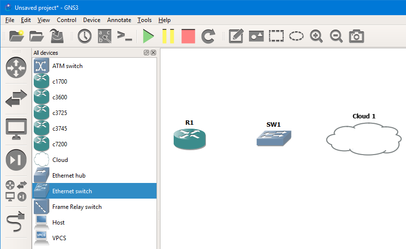
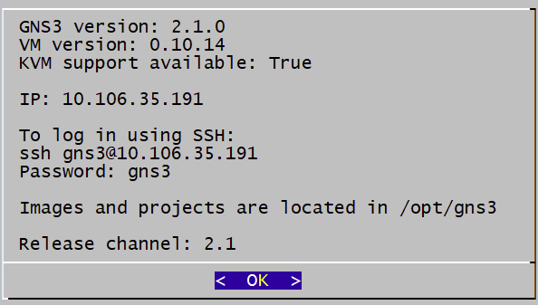
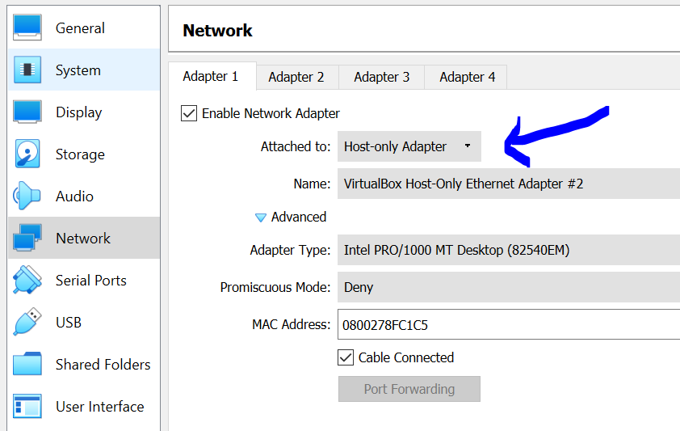
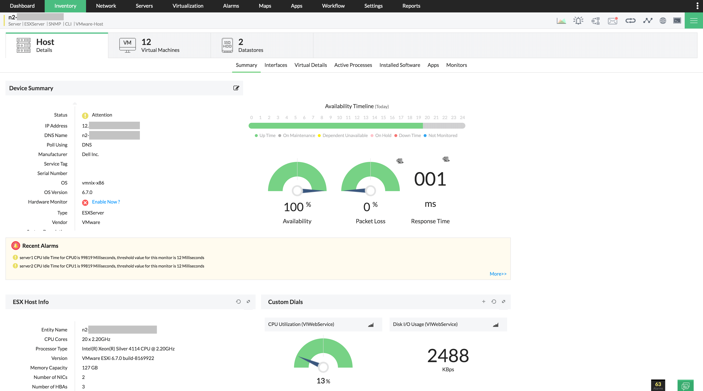

# GNS3 + Virtualización en Windows 11

---

## 1. Arquitectura de Virtualización en Windows 11

La virtualización es una tecnología que permite ejecutar múltiples sistemas operativos sobre un mismo hardware físico mediante el uso de un hipervisor. Esto es posible gracias a extensiones del procesador como **Intel VT-x** o **AMD-V**, las cuales habilitan la virtualización por hardware.

En Windows 11, existen mecanismos de seguridad avanzados como el **Aislamiento de Núcleo (Core Isolation)** y **VBS (Virtualization-Based Security)**. Estas tecnologías utilizan virtualización interna basada en Hyper-V para proteger el sistema operativo.

Sin embargo, estas funciones pueden interferir con herramientas de virtualización de terceros como GNS3 o VirtualBox, ya que consumen o bloquean el acceso a las extensiones de virtualización del procesador, lo que puede provocar errores como la imposibilidad de usar KVM.

### Verificación de virtualización habilitada

Para comprobar si la virtualización está activa en el sistema:

1. Abrir el **Administrador de tareas**
2. Ir a la pestaña **Rendimiento**
3. Seleccionar **CPU**
4. Verificar que el estado indique: **"Virtualización: Habilitado"**

---

## 2. GNS3 VM: El Motor de Simulación

GNS3 utiliza una máquina virtual denominada **GNS3 VM**, la cual actúa como servidor encargado de ejecutar dispositivos de red de forma eficiente.

Esta máquina virtual se basa en **KVM (Kernel-based Virtual Machine)**, una tecnología de virtualización que permite ejecutar máquinas virtuales con acceso directo al hardware, mejorando significativamente el rendimiento.

### Importancia de KVM

Es fundamental que en la configuración de GNS3 se muestre el estado:

Si el estado aparece como **False**, significa que la virtualización por hardware no está siendo utilizada correctamente, lo que genera bajo rendimiento o fallos en la ejecución de dispositivos de red.

### Asignación de recursos

Para un funcionamiento estable:
- CPU: 2 a 4 núcleos
- RAM: 4 GB (mínimo recomendado)

---

## 3. Integración con VirtualBox

VirtualBox es un hipervisor de tipo 2 (hosted), lo que significa que se ejecuta sobre un sistema operativo como Windows 11.

### Configuración de red: Adaptador Host-Only

Para permitir la comunicación entre GNS3 y las máquinas virtuales, se debe configurar un adaptador de red **Host-Only**, el cual crea una red privada entre el host y las VMs.

### Modo Promiscuo

El **modo promiscuo** permite que una interfaz de red reciba todo el tráfico que circula por la red, no solo el destinado a su dirección MAC.

Esto es esencial en GNS3 porque:
- Permite el funcionamiento correcto de switches virtuales
- Facilita la simulación de tráfico de **Capa 2 (Ethernet)**

Configuración recomendada:
- Modo promiscuo: **Permitir todo**

---

## 4. Integración con VMware ESXi

VMware ESXi es un hipervisor de tipo 1 (bare-metal), lo que significa que se instala directamente sobre el hardware físico, ofreciendo un mayor rendimiento y eficiencia.

### Arquitectura Cliente-Servidor

En este escenario:
- El cliente (GUI de GNS3) se ejecuta en la computadora del usuario
- El servidor (GNS3 Server) puede estar en un host remoto con ESXi

Esto permite ejecutar laboratorios complejos sin sobrecargar la máquina local.

### Seguridad en vSwitch

En ESXi, los **vSwitches** controlan el tráfico de red de las máquinas virtuales. Para que GNS3 funcione correctamente, se deben ajustar las siguientes políticas de seguridad en el port group:

- **Promiscuous Mode:** Permitir  
- **MAC Address Changes:** Permitir  
- **Forged Transmits:** Permitir  

---

## 5. Troubleshooting (Solución de Problemas)

| Error Detectado | Causa Técnica | Solución Implementada |
|----------------|--------------|----------------------|
| KVM aparece en False | Virtualización por hardware deshabilitada o bloqueada por Hyper-V | Activar VT-x/AMD-V en BIOS o desactivar Hyper-V |
| No hay conectividad entre VMs | Configuración incorrecta del adaptador de red | Configurar adaptador Host-Only y modo promiscuo |
| Error de conexión (puerto 3080) | Firewall bloqueando tráfico | Crear regla para permitir puertos 3080 y 5000-10000 |

---

